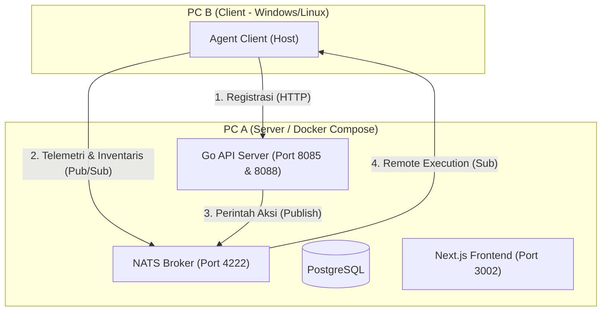

# 🚀 Panduan Pengujian Multi-PC: Sistem Helpdesk AI & Agent Client

Panduan ini menjelaskan langkah demi langkah untuk menguji integrasi sistem **Helpdesk AI** (yang berjalan di **PC A / Server**) dengan **Agent Client** yang berjalan di komputer lain (**PC B / Client**).

---

## 📐 Arsitektur Pengujian



---

## 🛠️ Langkah 1: Persiapan Jaringan (Koneksi PC A & PC B)

Agar PC B dapat berkomunikasi dengan PC A, kedua PC harus berada dalam satu jaringan lokal (Wi-Fi/LAN) yang sama.

### 1. Dapatkan IP Address PC A (Server)
Di **PC A**, buka terminal PowerShell/CMD dan jalankan:
```powershell
ipconfig
```
Cari bagian `IPv4 Address` pada adapter jaringan yang aktif (contoh: `192.168.1.50` atau `10.20.0.46`). Catat IP ini sebagai **`IP_PC_A`**.

### 2. Uji Koneksi dari PC B (Client)
Di **PC B**, buka terminal CMD/PowerShell dan lakukan ping ke PC A:
```powershell
ping IP_PC_A
```
*Pastikan ada respons (`Reply from IP_PC_A...`). Jika tidak ada respons, matikan sementara Windows Firewall di PC A atau tambahkan izin masuk.*

### 3. Buka Port Firewall di PC A (Server)
Agar PC A dapat menerima koneksi dari PC B, Anda harus membuka port NATS (`4222`), API (`8085` & `8088`), dan Frontend (`3002`) di firewall PC A.
Jalankan perintah PowerShell berikut sebagai **Administrator** di **PC A**:
```powershell
New-NetFirewallRule -DisplayName "Helpdesk NATS" -Direction Inbound -LocalPort 4222 -Protocol TCP -Action Allow
New-NetFirewallRule -DisplayName "Helpdesk API/Enroll" -Direction Inbound -LocalPort 8085,8088 -Protocol TCP -Action Allow
New-NetFirewallRule -DisplayName "Helpdesk Frontend" -Direction Inbound -LocalPort 3002 -Protocol TCP -Action Allow
```

---

## 💻 Langkah 2: Jalankan Server Utama (PC A)

Pastikan semua layanan Docker di **PC A** berjalan normal:
```powershell
cd c:\Agentic_Ai\Agentic_AI_Helpdesk\helpdesk-ai
docker-compose up -d
```
Pastikan seluruh container (Postgres, NATS, API, Frontend, dll) berstatus **Up (healthy)**:
```powershell
docker-compose ps
```

---

## ⚙️ Langkah 3: Jalankan Agent Client di Komputer Lain (PC B)

1. **Salin File**: Salin folder `client-agent` (khususnya file `agent-client.exe`) dari PC A ke **PC B**.
2. **Buka PowerShell sebagai Administrator**: Di **PC B**, cari *PowerShell*, klik kanan, lalu pilih **Run as Administrator** (ini sangat penting agar agen memiliki hak untuk menjalankan aksi remote seperti merestart service).
3. **Masuk ke Direktori**: Arahkan ke lokasi penyimpanan file `agent-client.exe` di PC B.
4. **Set Variabel Lingkungan & Jalankan**:
   Jalankan perintah berikut di PowerShell PC B (ganti `IP_PC_A` dengan IP PC A yang didapatkan di Langkah 1):

   ```powershell
   # Konfigurasi IP PC A
   $env:NATS_URL="nats://IP_PC_A:4222"
   $env:CONTROLLER_ENROLL_URL="http://IP_PC_A:8085/enroll"

   # Kredensial Autentikasi NATS
   $env:NATS_USER="agent-client"
   $env:NATS_PASSWORD="agent-pass"

   # Port HTTP internal agen (Gunakan 8082 agar tidak konflik dengan Zammad)
   $env:AGENT_PORT="8082"

   # Jalankan Agent Client
   .\agent-client.exe
   ```

PS C:\WINDOWS\system32> cd C:\client-agent\
PS C:\client-agent> $env:NATS_URL="nats://10.20.0.46:4222"
PS C:\client-agent> $env:NATS_USER="agent-client"
PS C:\client-agent> $env:NATS_PASSWORD="agent-pass"
PS C:\client-agent> $env:ENROLL_URL="http://10.20.0.46:8085/enroll"
PS C:\client-agent> .\agent-client.exe


   **Log Sukses pada PC B:**
   ```text
   Helpdesk Client Agent starting
   NATS connected to nats://IP_PC_A:4222 (Auth: true)
   subscribed to NATS agent.cmd.NAMA_PC_B
   sent registration request for NAMA_PC_B
   Starting agent HTTP server on :8082
   published inventory to inventory.NAMA_PC_B
   ```

---

## 🧪 Langkah 4: Skenario Pengujian Sinkronisasi & Auto-Fix

Mari kita uji skenario di mana **PC B** mengalami masalah printer spooler, dan sistem di **PC A** secara otomatis mendeteksi, meminta persetujuan, dan memperbaiki PC B dari jarak jauh.

### 1. Verifikasi Registrasi PC B di PC A
Di **PC A**, buka dasbor frontend di browser: `http://localhost:3002` (atau langsung query database PostgreSQL di PC A):
```powershell
docker-compose exec postgres psql -U helpdesk -d helpdesk_ai -c "SELECT hostname, os, status, last_seen FROM agent_registry;"
```
**Ekspektasi**: Nama PC B (hostname PC B) akan terdaftar di database dengan status `online`.

### 2. Laporkan Masalah (Simulasi Tiket Masuk)
Kirim tiket baru dengan keluhan terkait printer spooler yang macet di PC B. Anda bisa mengirimkannya lewat Telegram bot atau Frontend di PC A dengan deskripsi:
> *"Printer spooler service di PC B (NAMA_PC_B) mendadak mati, tolong perbaiki spooler."*

### 3. AI Mendiagnosis & Mengajukan Solusi Otomatis
1. Masuk ke halaman dasbor **Semua Tiket** di Frontend PC A.
2. Klik tiket yang baru dibuat untuk membuka modal detail.
3. Buka tab **Diagnosis AI**.
4. **Ekspektasi**: Sistem AI secara otomatis mendeteksi kata kunci *printer* & *spooler*, kemudian mengajukan usulan aksi remote (*proposed action*): **`Restart-Service -Name Spooler`** dengan status **`proposed`**.

### 4. Setujui Aksi (Approve Action)
Di dasbor Frontend PC A, klik tombol **Approve/Setujui** untuk usulan tindakan *Restart Spooler* tersebut. 

### 5. Verifikasi Eksekusi Nyata di PC B
Segera setelah Anda menekan tombol Approve di dasbor PC A:
1. Periksa layar terminal terminal Agen Client di **PC B**.
2. **Ekspektasi**: Agen di PC B akan langsung menerima pesan perintah dari NATS dan mengeksekusinya:
   ```text
   nats msg on agent.cmd.NAMA_PC_B
   Executing remote action: restart_service
   action result: [Hasil eksekusi Windows restart service spooler]
   ```
3. Layanan Print Spooler di PC B berhasil dijalankan ulang tanpa intervensi fisik dari teknisi! 🎉

---

## 💡 Troubleshooting

* **Eror: `NATS init failed: dial tcp...`**: Pastikan firewall di PC A telah dibuka (Langkah 1.3) dan IP PC A yang diinput pada PC B sudah benar.
* **Eror: `exit status 1` pada Agen**: Pastikan terminal PowerShell di PC B dibuka menggunakan opsi **Run as Administrator**.
* **Zammad Conflict**: Jika PC B juga memiliki Zammad, pastikan variabel `$env:AGENT_PORT` diset ke port kosong lain (misalnya `8083` atau `9090`).
## Default Credentials

| Role | Username | Password |
|------|----------|----------|
| Admin | admin | ChangeMe@123 |
| Tech 1 | rendy.m | ChangeMe@123 |
| Tech 2 | alif.f | ChangeMe@123 |
| Tech 3 | m.ramadhan | ChangeMe@123 |
| Tech 4 | febryano.b | ChangeMe@123 |
